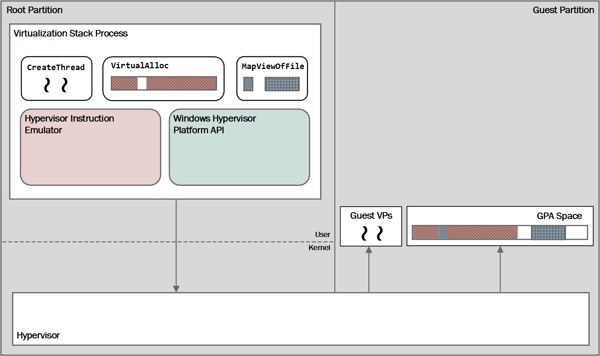

# Windows Hypervisor Platform API Definitions

>**This API is available starting in the Windows April 2018 Update.**

The following diagram provides a high-level overview of the third-party architecture.

The following section contains the definitions of the Windows Hypervisor Platform APIs that are exposed through `WinHvPlatform.h`. `WinHvPlatform.dll` (located in the System32 folder) exports a set of C-style Windows API functions which return HRESULT error codes. The headers are published with the [Windows SDK](https://developer.microsoft.com/en-us/windows/downloads/windows-sdk/) package.

## Platform Capabilities

|Function   |Description|
|---|---|
|[WHvGetCapability](funcs/WHvGetCapability.md)|Platform capabilities are a generic way for callers to query properties and capabilities of the hypervisor, of the API implementation, and of the hardware platform that the application is running on. The platform API uses these capabilities to publish the availability of extended functionality of the API as well as the set of features that the processor on the current system supports.|

To determine whether the current system supports the Windows Hypervisor Platform on Arm64, call [`WHvGetCapability`](funcs/WHvGetCapability.md) with `WHvCapabilityCodeFeatures` and test the `Arm64Support` bit of the returned `WHV_CAPABILITY_FEATURES` value.

## Partition Creation, Setup, and Deletion

|Function   |Description|
|---|---|
|[WHvCreatePartition](funcs/WHvCreatePartition.md)|Creating a partition creates a new partition object. Additional properties of the partition are stored in the partition object and are applied when creating the partition in the hypervisor.|
|[WHvSetupPartition](funcs/WHvSetupPartition.md)|Setting up the partition causes the actual partition to be created in the hypervisor. A partition needs to be set up prior to performing any other operation on the partition after it was created, with the exception of configuring the initial properties of the partition.|
|[WHvDeletePartition](funcs/WHvDeletePartition.md)|Deleting a partition tears down the partition object and releases all resources that the partition was using.|

## Partition Properties

Partition properties provide the mechanism for callers to query and configure the characteristics of a partition. Querying a property returns the current value of that property, which provides the default value determined by the hypervisor and API implementations in case the property hasn’t been previously modified by the caller. 

The availability of features that can be configured through the partition properties depends on the capabilities of the hypervisor, API implementation and the physical processor on the system. An application should check the corresponding capability before attempting to configure a property.

Several properties (for example, the properties that configure the processor features that are made available to the partition) can only be modified during the creation of the partition and prior to executing a virtual processor in the partition. An attempt to modify these properties after a partition started executing results in a failure of the operation.

For more information about the partition properties: [Partition Property Data Types](funcs/WHvPartitionPropertyDataTypes.md)

|Function   |Description|
|---|---|
|[WHvGetPartitionProperty](funcs/WHvGetPartitionProperty.md)|Querying a property returns the current value of that property, which provides the default value determined by the hypervisor and API implementations in case the property hasn’t been previously modified by the caller.|
|[WHvSetPartitionProperty](funcs/WHvSetPartitionProperty.md)|Sets the configuration of partition properties. |

## Partition Reset and Migration

A partition can be reset to its initial state, and a running partition can be migrated from one host to another. Migration is a multi-step process that is started on the source host, accepted on the destination host, and then either completed or canceled on the source host.

|Function   |Description|
|---|---|
|[WHvResetPartition](funcs/WHvResetPartition.md)|Resets a partition to its initial state.|
|[WHvStartPartitionMigration](funcs/WHvStartPartitionMigration.md)|Begins migrating a partition on the source host.|
|[WHvAcceptPartitionMigration](funcs/WHvAcceptPartitionMigration.md)|Accepts a migrating partition on the destination host.|
|[WHvCompletePartitionMigration](funcs/WHvCompletePartitionMigration.md)|Finalizes a partition migration on the source host.|
|[WHvCancelPartitionMigration](funcs/WHvCancelPartitionMigration.md)|Aborts an in-progress partition migration on the source host.|

## VM Memory Management

The physical address space of the VM partition (the GPA space) is populated using memory allocated in the user-mode process of the virtualization stack. The virtualization stack allocates the required memory using standard Windows memory-management functions (such as `VirtualAlloc`), or maps a file into its process, and uses the addresses of these regions to map the memory into the partition’s GPA space.

For more information about the memory data types: [Memory Data Types](funcs/WHvMemoryDataTypes.md)

|Function   |Description|
|---|---|
|[WHvMapGpaRange](funcs/WHvMapGpaRange.md)|Creating a mapping for a range in the GPA space of a partition sets a region in the caller’s process as the backing memory for that range. The operation replaces any previous mappings for the specified GPA pages.|
|[WHvMapGpaRange2](funcs/WHvMapGpaRange2.md)|Maps a range of the guest physical address space of a partition to memory in a specified host process.|
|[WHvUnmapGpaRange](funcs/WHvUnmapGpaRange.md)|Unmapping a previously mapped GPA range makes the memory range unavailable to the partition. Any further access by a virtual processor to the range will result in a memory access exit.|
|[WHvAdviseGpaRange](funcs/WHvAdviseGpaRange.md)|Provides hints to the hypervisor about the memory backing one or more guest physical address ranges.|
|[WHvReadGpaRange](funcs/WHvReadGpaRange.md)|Reads up to `WHV_READ_WRITE_GPA_RANGE_MAX_SIZE` bytes from the guest physical address space of a partition.|
|[WHvWriteGpaRange](funcs/WHvWriteGpaRange.md)|Writes up to `WHV_READ_WRITE_GPA_RANGE_MAX_SIZE` bytes to the guest physical address space of a partition.|
|[WHvTranslateGva](funcs/WHvTranslateGva.md)|Translating a virtual address used by a virtual processor in a partition allows the virtualization stack to emulate a processor instruction for an I/O operation, using the results of the translation to read and write the memory operands of the instruction in the GPA space of the partition.|
|[WHvQueryGpaRangeDirtyBitmap](funcs/WHvQueryGpaRangeDirtyBitmap.md)|Queries a range of GPA space to determine which pages the guest has modified since the last query of the range.|

## Virtual Processor Execution

The virtual processors of a VM are executed using the new integrated scheduler of the hypervisor. To run a virtual processor, a thread in the virtualization-stack process issues a blocking call to execute the virtual processor in the hypervisor. The call returns when the virtual processor performs an operation that the virtualization stack must handle, or when the virtualization stack requests an exit.  

A thread that handles a virtual processor executes the following basic operations:

1. Create the virtual processor in the partition.
2. Setup the state of the virtual processor, which includes injecting pending interrupts and events into the processor.
3. Run the virtual processor.
4. Upon return from running the virtual processor, query the state of the processor and handle the operation that caused the processor to stop running.
5. If the virtual processor is still active, go back to Step 2 to continue to run the processor.
6. Delete the virtual processor in the partition.  

The state of the virtual processor includes the hardware registers and any interrupts the virtualization stack wants to inject into the virtual processor.

|Function   |Description|
|---|---|
|[WHvCreateVirtualProcessor](funcs/WHvCreateVirtualProcessor.md)|This function creates a new virtual processor in a partition. The index of the virtual processor is used to set the APIC ID of the processor.|
|[WHvCreateVirtualProcessor2](funcs/WHvCreateVirtualProcessor2.md)|Creates a new virtual processor in a partition with optional creation-time properties.|
|[WHvDeleteVirtualProcessor](funcs/WHvDeleteVirtualProcessor.md)|This function deletes a virtual processor in a partition.|
|[WHvRunVirtualProcessor](funcs/WHvRunVirtualProcessor.md)|This function runs the virtual processor (that is, it runs guest code). A call to this function blocks synchronously until either the virtual processor executed an operation that needs to be handled by the virtualization stack (for example, accessed memory in the GPA space that is not mapped or not accessible) or the virtualization stack explicitly requests an exit of the function (for example, to inject an interrupt for the virtual processor or to change the state of the VM). |
|[WHvCancelRunVirtualProcessor](funcs/WHvCancelRunVirtualProcessor.md)|Canceling the execution of a virtual processor allows an application to abort the call to run the virtual processor by another thread, and to return the control to that thread. The virtualization stack can use this function to return the control of a virtual processor back to the virtualization stack in case it needs to change the state of a VM or to inject an event into the processor. |

### Exit Context

The detailed reason and additional information for the exit of the [`WHvRunVirtualProcessor`](funcs/WHvRunVirtualProcessor.md) function is returned in an output buffer of the function that receives a context structure for the exit. The data provided in this context buffer is specific to the individual exit reason, and for simple exit reasons the buffer might be unused (`RunVpExitLegacyFpError` and `RunVpExitInvalidVpRegisterValue`).

|Structures   |Description|
|---|---|
|[Exit Contexts](funcs/WHvExitContextDataTypes.md)| The context structures for several exit reasons share common definitions for the data that provides information about the processor instruction that caused the exit and the state of the virtual processor at the time of the exit. |
|[Memory Access](funcs/MemoryAccess.md)| Information about exits caused by the virtual processor accessing a memory location that is not mapped or not accessible is provided by the `WHV_MEMORY_ACCESS_CONTEXT` structure.  |
|[I/O Port Access](funcs/IOPortAccess.md)|Information about exits caused by the virtual processor executing an I/O port instruction (IN, OUT, INS, and OUTS) is provided in the `WHV_X64_IO_PORT_ACCESS_CONTEXT` structure.|
|[MSR Access](funcs/MSRAccess.md)|Information about exits caused by the virtual processor accessing a model specific register (MSR) using the RDMSR or WRMSR instructions is provided in the `WHV_X64_MSR_ACCESS_CONTEXT` structure. |
|[CPUID Access](funcs/CPUIDAccess.md)|Information about exits caused by the virtual processor executing the CPUID instruction is provided in the `WHV_X64_CPUID_ACCESS_CONTEXT` structure.|
|[Virtual Processor Exception](funcs/VirtualProcessorException.md)|Information about an exception generated by the virtual processor is provided in the `WHV_VP_EXCEPTION_CONTEXT` structure.|
|[Interrupt Window](funcs/InterruptWindow.md)|Information about exits caused by the virtual processor when the interruptibility state of the processor would allow delivery of a given interrupt. |
|[Unsupported Feature](funcs/UnsupportableFeature.md)|An exit for an unsupported feature occurs when the virtual processor accesses an architectural feature that the hypervisor does not properly virtualize. |
|[Execution Cancelled](funcs/ExecutionCancelled.md)|Information about an exit caused by the host system is provided in the `WHV_RUN_VP_CANCELLED_CONTEXT` structure. |
|[RDTSC(P)](funcs/Rdtsc.md)|Information about exits caused by the virtual processor executing the RDTSC(P) instruction is provided in the `WHV_X64_RDTSC_CONTEXT` structure.|
|[Register Intercept](funcs/RegisterIntercept.md)|Information about an Arm64 exit caused by an intercepted system register access is provided in the `WHV_REGISTER_CONTEXT` structure.|
|[Arm64 Reset](funcs/Arm64Reset.md)|Information about an Arm64 exit caused by a virtual processor reset request is provided in the `WHV_ARM64_RESET_CONTEXT` structure.|

### Virtual Processor Registers

The state of a virtual processor, which includes both the state defined by the underlying architecture (such as general-purpose registers) and additional state defined by the hypervisor, can be accessed through these functions.

For more information about the registers see: [Virtual Processor Register Names and Values](funcs/WHvVirtualProcessorDataTypes.md)

|Function   |Description|
|---|---|
|[WHvGetVirtualProcessorRegisters](funcs/WHvGetVirtualProcessorRegisters.md)|This function allows for querying a set of individual registers by the virtualization stack.|
|[WHvGetVirtualProcessorXsaveState](funcs/WHvGetVirtualProcessorXsaveState.md)|This function allows for querying a virtual processor's XSAVE state. Deprecated; use [WHvGetVirtualProcessorState](funcs/WHvGetVirtualProcessorState.md).|
|[WHvSetVirtualProcessorRegisters](funcs/WHvSetVirtualProcessorRegisters.md)|This function allows for setting a set of individual registers by the virtualization stack.|
|[WHvSetVirtualProcessorXsaveState](funcs/WHvSetVirtualProcessorXsaveState.md)|This function allows for setting a virtual processor's XSAVE state. Deprecated; use [WHvSetVirtualProcessorState](funcs/WHvSetVirtualProcessorState.md).|

### Interrupt controller virtualization

Optionally, the hypervisor platform can emulate a local APIC interrupt controller. For virtual machines where an APIC is required, using the platform's built-in emulation yields the best performance. On Arm64, a partition must use the emulated interrupt controller (GIC), which is configured before the partition is set up. For more information, see [`WHvSetupPartition`](funcs/WHvSetupPartition.md).

When this functionality is enabled, these functions can be used to request virtual interrupts and to query and set interrupt controller state.

|Function|Description|
|---|---|
|[WHvRequestInterrupt](funcs/WHvRequestInterrupt.md)|Requests a virtual interrupt.|
|[WHvGetInterruptTargetVpSet](funcs/WHvGetInterruptTargetVpSet.md)|Resolves an interrupt destination to the set of target virtual processors.|
|[WHvGetVirtualProcessorInterruptControllerState](funcs/WHvGetVirtualProcessorInterruptControllerState.md)|Gets a virtual processor's interrupt controller state. Deprecated; use [WHvGetVirtualProcessorState](funcs/WHvGetVirtualProcessorState.md).|
|[WHvGetVirtualProcessorInterruptControllerState2](funcs/WHvGetVirtualProcessorInterruptControllerState2.md)|Gets a virtual processor's interrupt controller state in the standard external state format. Deprecated; use [WHvGetVirtualProcessorState](funcs/WHvGetVirtualProcessorState.md).|
|[WHvSetVirtualProcessorInterruptControllerState](funcs/WHvSetVirtualProcessorInterruptControllerState.md)|Sets a virtual processor's interrupt controller state. Deprecated; use [WHvSetVirtualProcessorState](funcs/WHvSetVirtualProcessorState.md).|
|[WHvSetVirtualProcessorInterruptControllerState2](funcs/WHvSetVirtualProcessorInterruptControllerState2.md)|Sets a virtual processor's interrupt controller state in the standard external state format. Deprecated; use [WHvSetVirtualProcessorState](funcs/WHvSetVirtualProcessorState.md).|

### Virtual Processor State

In addition to individual registers, the saved state of a virtual processor can be queried and set by category, and the CPUID results that a virtual processor observes can be queried.

|Function|Description|
|---|---|
|[WHvGetVirtualProcessorState](funcs/WHvGetVirtualProcessorState.md)|Retrieves a category of saved state from a virtual processor.|
|[WHvSetVirtualProcessorState](funcs/WHvSetVirtualProcessorState.md)|Sets a category of saved state on a virtual processor.|
|[WHvGetVirtualProcessorCpuidOutput](funcs/WHvGetVirtualProcessorCpuidOutput.md)|Returns the CPUID result a virtual processor would observe for a given leaf.|

### Synthetic Interrupt Controller (SynIC)

These functions deliver synthetic interrupt controller (SynIC) events and messages to a virtual processor.

|Function|Description|
|---|---|
|[WHvSignalVirtualProcessorSynicEvent](funcs/WHvSignalVirtualProcessorSynicEvent.md)|Signals a synthetic interrupt controller event flag on a virtual processor.|
|[WHvPostVirtualProcessorSynicMessage](funcs/WHvPostVirtualProcessorSynicMessage.md)|Posts a synthetic interrupt controller message to a virtual processor.|

### Counters

These functions can be used to query various hypervisor platform counters.

|Function|Description|
|---|---|
|[WHvGetPartitionCounters](funcs/WHvGetPartitionCounters.md)|This function allows querying counters for a partition.|
|[WHvGetVirtualProcessorCounters](funcs/WHvGetVirtualProcessorCounters.md)|This function allows querying counters for a virtual processor.|

## Doorbells

A doorbell allows the virtualization stack to be notified through a Windows event object when a guest writes a specified value to a specified guest physical address.

> [!NOTE]
> The doorbell functions are deprecated. Use a notification port of type `WHvNotificationPortTypeDoorbell` (see [Notification Ports](#notification-ports)) instead.

For more information about the doorbell data types: [Doorbell Data Types](funcs/WHvDoorbellDataTypes.md)

|Function|Description|
|---|---|
|[WHvRegisterPartitionDoorbellEvent](funcs/WHvRegisterPartitionDoorbellEvent.md)|Registers an event to be signaled when a guest writes to a specified guest physical address. Deprecated; use [WHvCreateNotificationPort](funcs/WHvCreateNotificationPort.md).|
|[WHvUnregisterPartitionDoorbellEvent](funcs/WHvUnregisterPartitionDoorbellEvent.md)|Unregisters a previously registered partition doorbell event. Deprecated; use [WHvDeleteNotificationPort](funcs/WHvDeleteNotificationPort.md).|

## Triggers

A trigger delivers a pre-configured interrupt or event to a partition when a host event object is signaled.

For more information about the trigger data types: [Trigger Data Types](funcs/WHvTriggerDataTypes.md)

|Function|Description|
|---|---|
|[WHvCreateTrigger](funcs/WHvCreateTrigger.md)|Creates a trigger object that delivers a pre-configured interrupt or event to a partition when a host event is signaled.|
|[WHvUpdateTriggerParameters](funcs/WHvUpdateTriggerParameters.md)|Updates the parameters of an existing trigger object.|
|[WHvDeleteTrigger](funcs/WHvDeleteTrigger.md)|Deletes a trigger object from a partition.|

## Notification Ports

A notification port signals a Windows event object when a partition generates a matching event.

For more information about the notification port data types: [Notification Port Data Types](funcs/WHvNotificationPortDataTypes.md)

|Function|Description|
|---|---|
|[WHvCreateNotificationPort](funcs/WHvCreateNotificationPort.md)|Creates a notification port that signals a Windows event object when the partition generates a matching event.|
|[WHvSetNotificationPortProperty](funcs/WHvSetNotificationPortProperty.md)|Sets a property on an existing notification port.|
|[WHvDeleteNotificationPort](funcs/WHvDeleteNotificationPort.md)|Deletes a notification port.|

## Virtual PCI (VPCI) Devices

The Windows Hypervisor Platform can assign a physical PCI device to a partition as a virtual PCI (VPCI) device. These functions allocate the backing resources, create and delete VPCI devices, query their properties and notifications, map their MMIO ranges, manage their power state, and access their registers.

For more information about the VPCI data types: [Virtual PCI Data Types](funcs/WHvVpciDataTypes.md)

|Function|Description|
|---|---|
|[WHvAllocateVpciResource](funcs/WHvAllocateVpciResource.md)|Allocates a virtual PCI (VPCI) resource to back a virtual device.|
|[WHvCreateVpciDevice](funcs/WHvCreateVpciDevice.md)|Creates a virtual PCI (VPCI) device and assigns its resources to a partition.|
|[WHvDeleteVpciDevice](funcs/WHvDeleteVpciDevice.md)|Destroys a virtual PCI (VPCI) device and releases its resources.|
|[WHvGetVpciDeviceProperty](funcs/WHvGetVpciDeviceProperty.md)|Retrieves a property of a virtual PCI (VPCI) device.|
|[WHvGetVpciDeviceNotification](funcs/WHvGetVpciDeviceNotification.md)|Retrieves the next pending notification for a virtual PCI (VPCI) device.|
|[WHvMapVpciDeviceMmioRanges](funcs/WHvMapVpciDeviceMmioRanges.md)|Maps the MMIO ranges of a virtual PCI (VPCI) device into the caller's process.|
|[WHvUnmapVpciDeviceMmioRanges](funcs/WHvUnmapVpciDeviceMmioRanges.md)|Unmaps the MMIO ranges of a virtual PCI (VPCI) device from the caller's process.|
|[WHvSetVpciDevicePowerState](funcs/WHvSetVpciDevicePowerState.md)|Changes the power state of a virtual PCI (VPCI) device.|
|[WHvReadVpciDeviceRegister](funcs/WHvReadVpciDeviceRegister.md)|Reads a configuration space or MMIO register of a virtual PCI (VPCI) device.|
|[WHvWriteVpciDeviceRegister](funcs/WHvWriteVpciDeviceRegister.md)|Writes a configuration space or MMIO register of a virtual PCI (VPCI) device.|

### Virtual PCI (VPCI) Device Interrupts

These functions map, unmap, retarget, request, and query the MSI and MSI-X interrupts of an assigned virtual PCI device.

|Function|Description|
|---|---|
|[WHvMapVpciDeviceInterrupt](funcs/WHvMapVpciDeviceInterrupt.md)|Maps an MSI or MSI-X interrupt for an assigned virtual PCI device and returns the MSI address and data to program into the device.|
|[WHvUnmapVpciDeviceInterrupt](funcs/WHvUnmapVpciDeviceInterrupt.md)|Removes a previously mapped interrupt for an assigned virtual PCI device.|
|[WHvRetargetVpciDeviceInterrupt](funcs/WHvRetargetVpciDeviceInterrupt.md)|Changes the target vector and processor set for a previously mapped interrupt of an assigned virtual PCI device.|
|[WHvRequestVpciDeviceInterrupt](funcs/WHvRequestVpciDeviceInterrupt.md)|Delivers a logical interrupt to the partition that owns an assigned virtual PCI device.|
|[WHvGetVpciDeviceInterruptTarget](funcs/WHvGetVpciDeviceInterruptTarget.md)|Queries the current vector and processor set of a mapped interrupt for an assigned virtual PCI device.|
